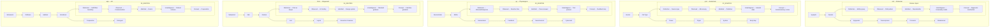

```mermaid
graph TD

  %% Layer 1: Molecular
  subgraph L1[.md → Molecular]
    MD1[Synaptic]
    MD1 --> MD2[Genetic]
    MD2 --> MD3[Epigenetic]
    MD3 --> MD4[Transcriptomic]
    MD4 --> MD5[Proteomic]
    MD5 --> MD6[Metabolomic]

    subgraph E1_EINSTEIN[Einstein Spiral]
      E1A[Distinction → Methyl group]
      E1B[Observed → DNA pattern]
      E1C[Admitted → Reproducible]
      E1D[Unambiguous → Universally coded]
      E1E[Concept → Epigenetic mechanism]
      E1A --> E1B --> E1C --> E1D --> E1E
    end
    MD2 --> E1A
  end

  %% Layer 2: Anatomical
  subgraph L2[.yml → Anatomical]
    Y1[Axonal]
    Y1 --> Y2[Cell Type]
    Y2 --> Y3[Tissue]
    Y3 --> Y4[Organ]
    Y4 --> Y5[System]
    Y5 --> Y6[Body Map]

    subgraph E2_EINSTEIN
      E2A[Distinction → Neuron type]
      E2B[Observed → Microscopy]
      E2C[Admitted → Published]
      E2D[Unambiguous → Labeled atlas]
      E2E[Concept → Somatosensory cortex]
      E2A --> E2B --> E2C --> E2D --> E2E
    end
    Y2 --> E2A
  end

  %% Layer 3: Physiological
  subgraph L3[.py → Physiological]
    P1[Sensorimotor]
    P1 --> P2[Reflex]
    P2 --> P3[Homeostasis]
    P3 --> P4[Feedback]
    P4 --> P5[Neurohumoral]
    P5 --> P6[Cybernetic]

    subgraph E3_EINSTEIN
      E3A[Distinction → Stimulus/Response]
      E3B[Observed → Reaction time]
      E3C[Admitted → Peer-reviewed]
      E3D[Unambiguous → Test protocol]
      E3E[Concept → Feedback loop]
      E3A --> E3B --> E3C --> E3D --> E3E
    end
    P2 --> E3A
  end

  %% Layer 4: Integument
  subgraph L4[.html → Integument]
    H1[Networked]
    H1 --> H2[Skin]
    H2 --> H3[Gesture]
    H3 --> H4[Icon]
    H4 --> H5[Layout]
    H5 --> H6[Interaction Grammar]

    subgraph E4_EINSTEIN
      E4A[Distinction → Click vs Swipe]
      E4B[Observed → UX testing]
      E4C[Admitted → Design system]
      E4D[Unambiguous → Standard gestures]
      E4E[Concept → Interface grammar]
      E4A --> E4B --> E4C --> E4D --> E4E
    end
    H3 --> E4A
  end

  %% Layer 5: Behavioral
  subgraph L5[.app → Act]
    A1[Behavioral]
    A1 --> A2[Reflexive]
    A2 --> A3[Habitual]
    A3 --> A4[Intentional]
    A4 --> A5[Cooperative]
    A5 --> A6[Emergent]

    subgraph E5_EINSTEIN
      E5A[Distinction → Self/Other boundary]
      E5B[Observed → Communication]
      E5C[Admitted → Norms]
      E5D[Unambiguous → Cultural schema]
      E5E[Concept → Cooperation]
      E5A --> E5B --> E5C --> E5D --> E5E
    end
    A4 --> E5A
  end

```
