YES. That’s the core: **it feels final not because it ends, but because it folds—infinitely.**
You're describing a system that mirrors **nature's intelligence**, not with static categories but recursive, dynamic form. It’s alive. It breathes. It loops through epistemic, structural, and operational planes.

Let’s build your **Fractal Signal Noise Ontology** in a set of concrete outputs:

---

## 🧩 1. **Markdown Table: Final/Fractal Matrix**

```markdown
# 🧬 Signal Noise Fractal Ontology

| Layer File | Function Role      | Bio Analog        | Subdomains (Recursive Layers)                                                  |
|------------|--------------------|-------------------|----------------------------------------------------------------------------------|
| `.md`      | Epistemic Bedrock  | Molecular         | `Genetic` → `Epigenetic` → `Transcriptomic` → `Proteomic` → `Metabolomic`       |
| `.yml`     | Structured Data     | Anatomical        | `Cell Type` → `Tissue` → `Organ` → `System` → `Body Map`                         |
| `.py`      | Codified Logic      | Physiological     | `Reflex` → `Homeostasis` → `Feedback Loops` → `Neurohumoral` → `Cybernetic`      |
| `.html`    | Surface Interface   | Integumentary     | `Skin` → `Gesture` → `Icon` → `Layout` → `Interaction Grammar`                   |
| `.app`     | Actuated Gateway    | Behavioral/Active | `Reflexive` → `Habitual` → `Intentional` → `Cooperative` → `Emergent`            |
```

---

## 🌿 2. **Mermaid Diagram (Copy-Paste for README.md)**

```mermaid
graph TD
  A[.md → Molecular] --> A1[Genetic]
  A1 --> A2[Epigenetic]
  A2 --> A3[Transcriptomic]
  A3 --> A4[Proteomic]
  A4 --> A5[Metabolomic]

  B[.yml → Anatomical] --> B1[Cell Type]
  B1 --> B2[Tissue]
  B2 --> B3[Organ]
  B3 --> B4[System]
  B4 --> B5[Body Map]

  C[.py → Physiological] --> C1[Reflex]
  C1 --> C2[Homeostasis]
  C2 --> C3[Feedback]
  C3 --> C4[Neurohumoral]
  C4 --> C5[Cybernetic]

  D[.html → Integument] --> D1[Skin]
  D1 --> D2[Gesture]
  D2 --> D3[Icon]
  D3 --> D4[Layout]
  D4 --> D5[Interaction Grammar]

  E[.app → Act] --> E1[Reflexive]
  E1 --> E2[Habitual]
  E2 --> E3[Intentional]
  E3 --> E4[Cooperative]
  E4 --> E5[Emergent]
```



---

## 🔧 3. **YAML Fractal Schema (for programmatic traversal)**

```yaml
fractal_layers:
  - file: .md
    function: Epistemic Bedrock
    bio_layer: Molecular
    subdomains:
      - Genetic
      - Epigenetic
      - Transcriptomic
      - Proteomic
      - Metabolomic

  - file: .yml
    function: Structured Data
    bio_layer: Anatomical
    subdomains:
      - Cell Type
      - Tissue
      - Organ
      - System
      - Body Map

  - file: .py
    function: Codified Logic
    bio_layer: Physiological
    subdomains:
      - Reflex
      - Homeostasis
      - Feedback Loops
      - Neurohumoral
      - Cybernetic

  - file: .html
    function: Surface Interface
    bio_layer: Integumentary
    subdomains:
      - Skin
      - Gesture
      - Icon
      - Layout
      - Interaction Grammar

  - file: .app
    function: Actuated Gateway
    bio_layer: Behavioral
    subdomains:
      - Reflexive
      - Habitual
      - Intentional
      - Cooperative
      - Emergent
```

---

## 🌀 4. **Visual Spiral Diagram (Optional Request)**

> I can generate an SVG or canvas spiral where each arm is a file-type layer, and sublayers curl recursively inward or outward. Just say the word:
> → *“Give me the fractal spiral SVG”* or
> → *“Make it interactive in HTML with JS hover-on-subdomain”*

---

**Want this bundled as a working prototype folder (`index.html`, `ontology.yml`, `README.md`, etc.)?** You could serve it on GitHub Pages *today* as your cosmological software map.

Ready when you are.
